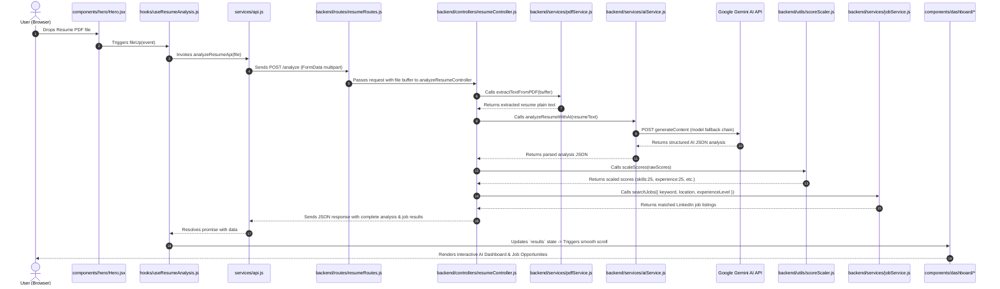

# ProResume AI — Industry-Standard Folder Structure & Architecture Documentation

Welcome to the architectural documentation for **ProResume AI**. This document provides a complete analysis of the project's folder structure, details the specific task and responsibility of each directory, and explains how backend and frontend components communicate with each other.

---

## 📁 1. Project Directory Layout

```
ProResume-AI/
├── FOLDER_STRUCTURE.md         # Architecture & Folder Responsibility Documentation
├── README.md                   # Project overview, setup, and deployment guides
├── vercel.json                 # Root Vercel deployment routing configuration
│
├── backend/                    # Node.js / Express REST API Service
│   ├── .env                    # Environment variables (GEMINI_API_KEY, PORT)
│   ├── .gitignore              # Git ignored files for backend
│   ├── package.json            # Node.js backend dependencies & scripts
│   ├── package-lock.json       # Dependency lock file
│   ├── server.js               # Main Express app entrypoint & Vercel serverless export
│   ├── vercel.json             # Backend serverless configuration for Vercel
│   │
│   ├── config/                 # Global Configuration & Constants
│   │   └── constants.js        # Category max limits, Gemini models fallback list
│   │
│   ├── controllers/            # Request Handlers & Orchestration
│   │   └── resumeController.js # Handles PDF upload, orchestration of services & scaling
│   │
│   ├── routes/                 # Express API Route Definitions
│   │   └── resumeRoutes.js     # Defines POST /analyze & POST / endpoint with Multer
│   │
│   ├── services/               # Core Business Logic & External Integrations
│   │   ├── aiService.js        # Google Gemini AI API integration & prompt builder
│   │   ├── jobService.js       # LinkedIn job search integration with timeout handling
│   │   └── pdfService.js       # PDF text extraction & validation logic
│   │
│   └── utils/                  # Shared Utility Functions
│       └── scoreScaler.js      # Mathematical category score scaling helper
│
└── frontend/                   # React + Vite Web Application
    ├── .env                    # Frontend environment variables (VITE_API_URL)
    ├── .gitignore              # Git ignored files for frontend
    ├── index.html              # Single Page Application HTML root template
    ├── package.json            # React frontend dependencies & scripts
    ├── vite.config.js          # Vite build & bundler configuration
    ├── vercel.json             # Frontend Vercel deployment configuration
    │
    └── src/                    # Source Code Directory
        ├── main.jsx            # React root application DOM bootstrap
        ├── App.jsx             # Main dashboard container component
        ├── App.css             # Main styling overrides
        ├── index.css           # Global Tailwind CSS directives & theme setup
        │
        ├── blocks/             # Interactive Canvas & Particle UI Blocks
        │   ├── canvasCursor.jsx # Custom dynamic canvas cursor effect hook
        │   └── Backgrounds/    # Background effect components
        │       └── Waves/      # WebGL/Canvas animated waves background
        │
        ├── components/         # Modular React UI Components
        │   ├── common/         # Layout & Shared Infrastructure Components
        │   │   ├── Navbar.jsx  # Sticky top header navigation bar
        │   │   ├── Footer.jsx  # Bottom copyright & credits footer
        │   │   ├── Loader.jsx  # Fullscreen loading animation modal
        │   │   └── ScrollP.jsx # Scroll progress bar indicator at top of page
        │   │
        │   ├── hero/           # Hero Banner & File Upload Section
        │   │   └── Hero.jsx    # Drag-and-drop resume upload zone & demo button
        │   │
        │   └── dashboard/      # AI Results & Analytics Sub-Components
        │       ├── HeaderOverview.jsx # Overall score circle badge & TXT export button
        │       ├── CategoryScores.jsx # 5-category score progress bars
        │       ├── AtsCompatibility.jsx # ATS parser check grid & pass status
        │       ├── SalaryInsights.jsx # Location-based salary estimation card
        │       ├── ActionRoadmap.jsx  # Step-by-step career improvement roadmap
        │       ├── RecommendedRoles.jsx # AI recommended target career roles
        │       ├── SkillsAssessment.jsx # Strong, missing & improvement skills tags
        │       ├── DetailedFeedback.jsx # Qualitative strengths, weaknesses & tips
        │       └── JobMatches.jsx    # Real-time job search listings & filter search
        │
        ├── data/               # Static Mock & Demo Data
        │   └── demoData.js     # Sample resume analysis dataset for demo mode
        │
        ├── hooks/              # Custom React Hooks
        │   └── useResumeAnalysis.js # Encapsulates analysis state, uploads & demo handlers
        │
        ├── services/           # Frontend API Layer
        │   └── api.js          # Handles HTTP fetch requests to backend endpoints
        │
        └── utils/              # Client Utilities
            └── exportReport.js # Text report generator & browser download handler
```

---

## 🛠️ 2. Task & Responsibility of Each Folder

### 🅰️ Backend Folders (`/backend`)

1. **`backend/config/`**
   - **Task:** Contains global configuration files, environment settings, model definitions, and fixed constants.
   - **File:** `constants.js` — Defines `MAX_LIMITS` for scoring (e.g., Skills max 25, Experience max 25) and `GEMINI_MODELS` array used for AI model fallback execution.

2. **`backend/controllers/`**
   - **Task:** Serves as the HTTP request and response handler layer. Receives data from routes, delegates tasks to services, processes results, and returns HTTP responses.
   - **File:** `resumeController.js` — Receives uploaded PDF buffer from Multer, calls `pdfService` to extract text, invokes `aiService` for Gemini AI analysis, scales scores using `scoreScaler`, queries jobs via `jobService`, and outputs structured JSON to client.

3. **`backend/routes/`**
   - **Task:** Maps HTTP endpoints (`POST /analyze`, `POST /`) to specific controller methods and attaches endpoint-level middleware like Multer file upload.
   - **File:** `resumeRoutes.js` — Configures Multer memory storage and routes incoming POST requests to `analyzeResumeController`.

4. **`backend/services/`**
   - **Task:** Contains core business logic, third-party API communications, and complex data operations separated from HTTP routing logic.
   - **Files:**
     - `aiService.js`: Builds structured JSON prompts and handles API calls to Google Gemini (`gemini-3.5-flash-lite`, `gemini-3.6-flash`, etc.) with automatic model retry fallback logic.
     - `pdfService.js`: Parses Uint8Array binary buffer using `pdf-parse` library and returns validated extracted text.
     - `jobService.js`: Queries LinkedIn job listings based on location and extracted skills with a 5-second timeout safeguard.

5. **`backend/utils/`**
   - **Task:** Houses pure utility helper functions that are reusable across controllers or services.
   - **File:** `scoreScaler.js` — Takes raw scores out of 100 from Gemini AI and scales them mathematically to the 25/25/20/15/15 maximum limits.

---

### 🅱️ Frontend Folders (`/frontend/src`)

1. **`frontend/src/blocks/`**
   - **Task:** Contains dynamic visual UI effects, background animations, and interactive canvas components.
   - **Files:** `canvasCursor.jsx` (smooth interactive particle trail) and `Backgrounds/Waves/Waves.jsx` (animated WebGL/Canvas wave layer).

2. **`frontend/src/components/common/`**
   - **Task:** Shared layout infrastructure components present throughout the app interface.
   - **Files:** `Navbar.jsx` (header), `Footer.jsx` (footer), `Loader.jsx` (loading modal), `ScrollP.jsx` (top scroll progress bar).

3. **`frontend/src/components/hero/`**
   - **Task:** Manages the main landing hero section and interactive file drag-and-drop file upload interface.
   - **File:** `Hero.jsx` — Form dropzone for PDF file selection and "Try Sample Demo Resume" action button.

4. **`frontend/src/components/dashboard/`**
   - **Task:** Modularized analytics dashboard UI components displaying detailed AI feedback.
   - **Files:** 
     - `HeaderOverview.jsx`: Score summary card with circular badge and text report export button.
     - `CategoryScores.jsx`: Score distribution progress indicators.
     - `AtsCompatibility.jsx`: ATS status badge & parser validation rules grid.
     - `SalaryInsights.jsx`: Formatted salary ranges with currency support (USD, INR, EUR, GBP).
     - `ActionRoadmap.jsx`: 4-step action plan for resume optimization.
     - `RecommendedRoles.jsx`: Role fit percentages and qualification checklists.
     - `SkillsAssessment.jsx`: Color-coded skill pills for strong, missing, and improvement skills.
     - `DetailedFeedback.jsx`: Qualitative strengths, weaknesses, and improvement tips.
     - `JobMatches.jsx`: Real-time job search listings with instant search bar filtering.

5. **`frontend/src/data/`**
   - **Task:** Static mock datasets used for instant demo mode execution without relying on live backend uploads.
   - **File:** `demoData.js` — Realistic pre-computed resume analysis sample object.

6. **`frontend/src/hooks/`**
   - **Task:** Custom React Hooks encapsulating state management, side effects, and asynchronous flows.
   - **File:** `useResumeAnalysis.js` — Handles `results`, `loading`, `error` state, auto-scrolling to results, and triggers API or demo calls.

7. **`frontend/src/services/`**
   - **Task:** API communication layer connecting React components to the Express backend.
   - **File:** `api.js` — Prepares `FormData` with PDF file and executes POST fetch call to `VITE_API_URL`.

8. **`frontend/src/utils/`**
   - **Task:** Helper utility functions for client-side processing.
   - **File:** `exportReport.js` — Generates formatted `.txt` report file from analysis data and triggers client browser download.

---

## 🔄 3. How Folders & Modules Communicate With Each Other

The diagram below illustrates the end-to-end communication flow across folders from user file upload to AI evaluation and dashboard rendering.



---

## ⚡ Key Architecture Advantages

1. **Separation of Concerns:** Business logic (`services/`), HTTP routing (`routes/`), request orchestration (`controllers/`), configuration (`config/`), and utilities (`utils/`) are strictly separated.
2. **High Maintainability & Testability:** Individual services (e.g., `aiService.js`, `pdfService.js`) can be independently edited, mocked, or unit-tested without loading Express routes.
3. **Vercel Serverless Ready:** `backend/server.js` acts as both a standalone node server (`app.listen`) and a serverless entry point exported for `@vercel/node`.
4. **Reusability & Clean UI:** Frontend dashboard sections are broken down into self-contained React components (`<AtsCompatibility />`, `<SalaryInsights />`, `<JobMatches />`), keeping `App.jsx` clean and concise.
 